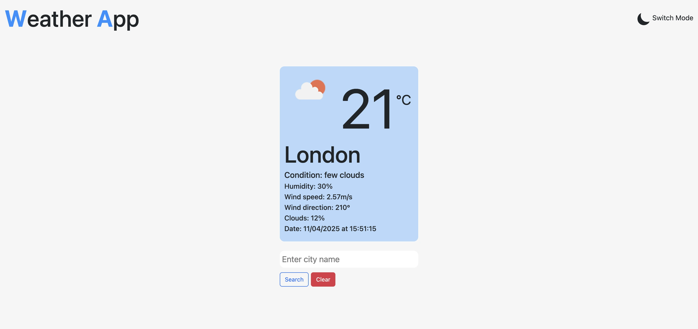
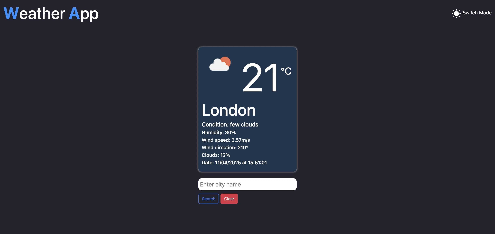

# Weather App

A weather application built using **React** and **TypeScript**, which dynamically fetches and displays weather data using the [OpenWeatherAPI](https://openweathermap.org/api). The app allows users to search for weather details of different cities, with a toggle for light and dark mode to enhance the user experience.

## Features

- **Search Button**: Users can input a city name and the app will fetch and display the current weather details for that city.
- **Dynamic Weather Updates**: The weather details are updated dynamically based on the user's input.
- **Light/Dark Mode Toggle Icon**: Easily switch between light and dark modes for a personalized experience.
- **Clear Button**: A button to refresh input field.

## Technologies Used

- **React**: Front-end library for building the user interface.
- **TypeScript**: Adds type safety to JavaScript, making the code more robust and easier to maintain.
- **OpenWeatherAPI**: A weather API used to fetch current weather data based on city input.
- **CSS and Bootstrap**: For styling the app, including light and dark modes.

## Installation

To run the app locally, follow these steps:

1. **Clone the repository**:
   ```bash
   git clone https://github.com/decencyokobia/weather-app.git
   ```

2. **Navigate into the project folder**:
   ```bash
   cd weather-app
   ```

3. **Install the dependencies**:
   ```bash
   npm install
   ```

4. **Create a `.env` file** in the root of the project and add your OpenWeatherAPI key:
   ```env
   REACT_APP_OPENWEATHER_API_KEY=your-api-key
   ```

5. **Run the app locally**:
   ```bash
   npm start
   ```

   This will start the development server, and you can access the app at `http://localhost:5173/weather-app/`.

## Usage

1. Enter a city name into the input field.
2. Click the "Search" button to fetch weather data for the city.
3. Toggle between light and dark modes for a different visual experience.
4. Click the "Clear" button to clear input field.

## Preview




## Contributing

Contributions are welcome! If you want to improve this project or add new features, feel free to fork the repository and submit a pull request.

## License

This project is licensed under the MIT License - see the [LICENSE](LICENSE) file for details.

## Acknowledgments

- [OpenWeatherAPI](https://openweathermap.org/api) for providing the weather data.
- The React and TypeScript communities for their great resources and documentation.
```